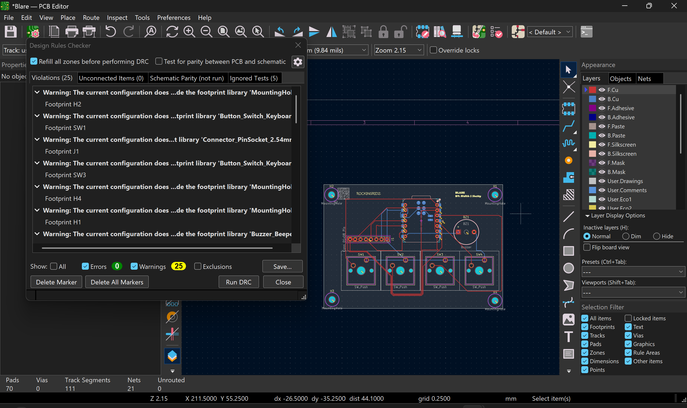
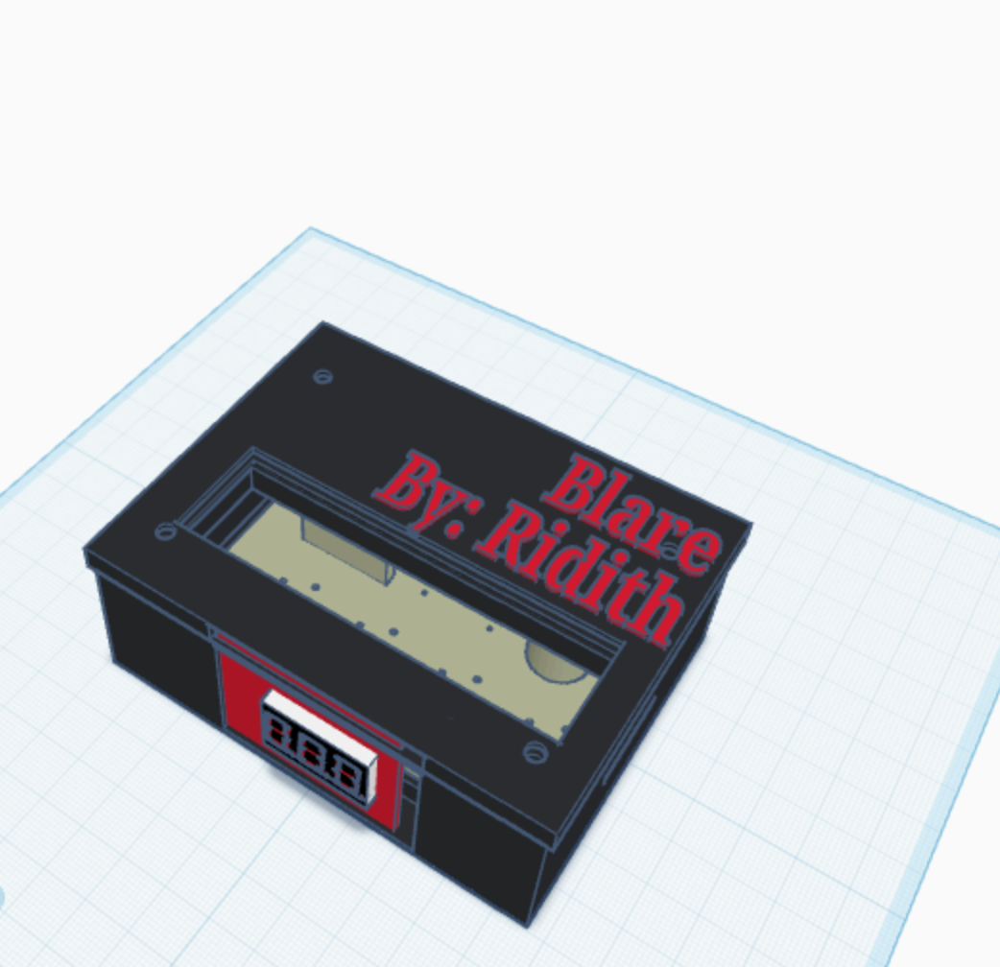

# Blare

Blare is a custom-designed, smart-ish alarm clock built with Hack Club's Stardance.

## What is Blare?

Blare is designed to solve the struggle of waking up in the morning. It features a custom 3D-printed enclosure, a custom PCB designed in KiCad, and an ST7789 display setup to ensure you actually get out of bed.

## Hardware & PCB Design

The project centers around a custom PCB layout featuring:
- **Microcontroller Integration:** Controlled via an ESP32-style layout.
- **User Input:** Four tactile push-buttons (`SW1`-`SW4`) for setting times and controls.
- **Alerts:** Onboard buzzer (`BZ1`) for the alarm sound.
- **Mounting:** Four corner mounting holes (`H1`-`H4`) matching the enclosure posts.
  

## Enclosure & CAD

- **Dimensions:** 95x74x35mm outer casing with a custom screen cutout (44x34mm).
- **Features:** Includes side vents, a USB port opening, and a two-piece design (base and lid) secured with M3 screw holes (3.2mm diameter with 6mm counterbores).
 

## Firmware

- **Platform:** Arduino IDE
- **Libraries Required:** `Adafruit_GFX`, `Adafruit_ST7789`, and `SPI`.
- **Display Configuration:** Configured for an unusual 284x76 resolution display using custom offsets (`82, 18`) and a subclass to handle initialization.

## Project Structure

- `cad/`: Contains the 3D model files (`blare_base.stl`, `blare_lid.stl`).
- `firmware/`: Source code for the microcontroller (`firmware.ino`).
- `pcb/`: KiCad project files and schematic layout.
- `production/`: All the files needed to get into building

## Status

Enclosure design and firmware layout are complete, moving into final assembly and testing.

